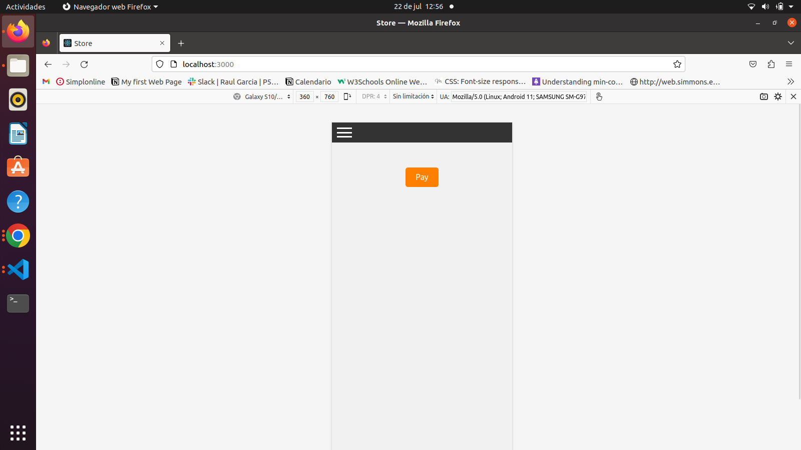
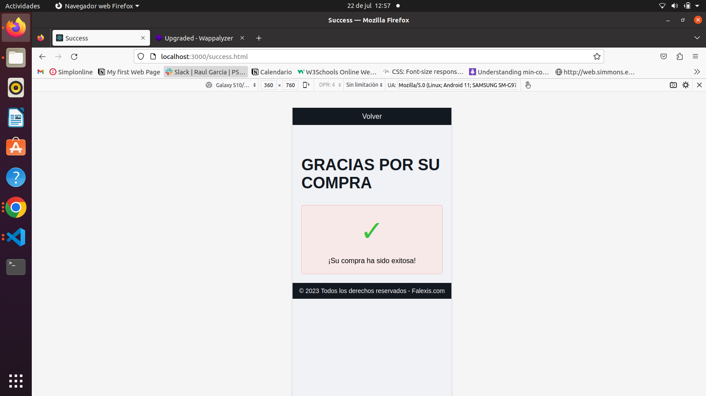

# imagen of project

# ____________________________________________________________

# STEP 1 
npm init -y

# STEP 2 INSTALAR LA DEPENDENCIA
npm i express stripe dotenv

# STEP 3
npm i nodemon -D

# STEP 4

https://stripe.com/docs/testing

# This project made with html, javascript, and ccs, in addition to using nodejs, express and stripe... below the link documentation

